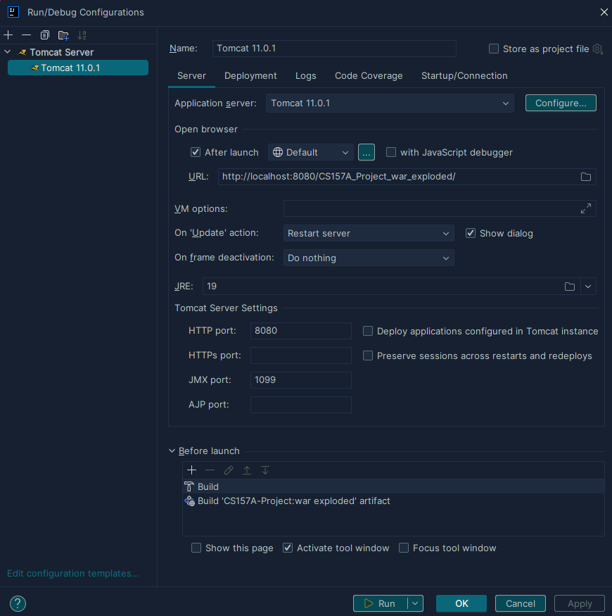
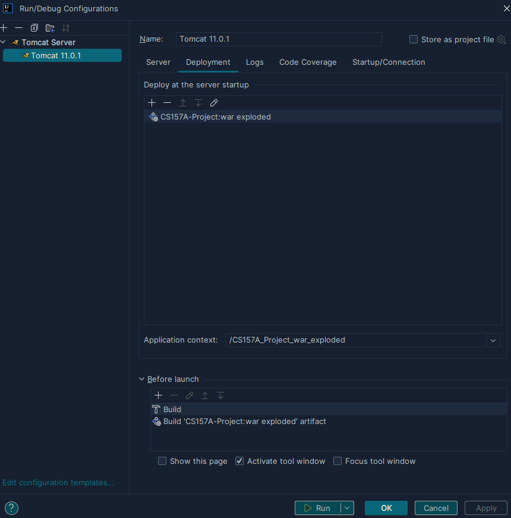

### Project Overview

We are developing an Online Bookstore Database System to serve as a digital platform for customers to browse books, place orders, and submit reviews, while enabling the bookstore to efficiently manage inventory, track orders, and handle reviews. This system aims to streamline customer interactions and inventory management. 

In light of the growing trend of online shopping and the reliance on digital systems, an efficient database is crucial for managing complex data, improving operations, and enhancing the customer experience. Our goal is to create a reliable and user-friendly platform for both customers and bookstore management.

### Instructions for set up and dependencies

The project requires the installation of Tomcat 11, as well as the MySQL connector mysql-connector-j-9.1.0.jar (located within lib). MySQL Workbench was used to manage the database and tables. 

The recommended IDE for running the project is Intellij IDEA Ultimate with the following run configurations:

**Server tab**

**Deployment tab**

These run configuration details can be found under the .idea/runConfigurations folder in the project.

The database user and password are specified within src/main/java/com/example/cs157aproject/DBConnection.java, to be USER = "root", PASSWORD = "milk2000A", with the connection URL = "jdbc:mysql://127.0.0.1:3306/test_schema". To run the project users can either create a user with these fields within MySQL Workbench, or change the user, password, and URL within the code to match their own.

Assuming the database and tables have been set up using the SQL code in create_schema.sql, and initialized using the initialize_data.sql scripts, the application should run with no issues after clicking the green run button in the top right corner within Intellij.